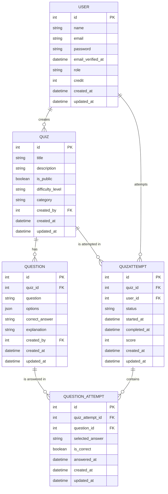

# Bài tập giữa kỳ: Xây dựng ứng dụng Quiz Learning

**Họ và tên sinh viên:** Trần Thành Long  
**Mã Sinh viên:** 23010070

## Mô tả dự án

Ứng dụng Quiz Learning là hệ thống tạo và làm bài trắc nghiệm trực tuyến, xây dựng với Laravel, Livewire, Volt và TailwindCSS.  
Người dùng có thể đăng ký tài khoản, tạo quiz, thêm câu hỏi, làm bài, xem lịch sử và phân tích kết quả.  
Toàn bộ chức năng CRUD và làm bài được triển khai qua Livewire SPA, realtime, không sử dụng REST API truyền thống.

## Demo ứng dụng
- **Website**: [https://next-quiz-learn.onrender.com/](https://next-quiz-learn.onrender.com/)
- **Tài khoản demo**:
   - **Email**: `admin@gmail.com`
   - **Mật khẩu**: `password`
- **Tài khoản người dùng**:
   - **Email**: `user@gmail.com`
   - **Mật khẩu**: `password`

### Tính năng nổi bật

- Đăng ký, đăng nhập, xác thực email, đổi mật khẩu, quản lý hồ sơ.
- Tạo, chỉnh sửa, xóa quiz, phân loại, đặt quyền public/private.
- Thêm/sửa/xóa câu hỏi, đáp án, giải thích.
- Làm bài trắc nghiệm với giao diện realtime, lưu tiến trình tự động.
- Xem lịch sử làm bài, phân tích kết quả chi tiết.
- Giao diện responsive, hỗ trợ dark mode, tối ưu trải nghiệm người dùng.

---

## Tính năng chính

### Dành cho Khách hàng:
- Đăng ký, đăng nhập, xác thực email, đổi mật khẩu, quản lý hồ sơ cá nhân.
- Duyệt, tìm kiếm, làm bài quiz với giao diện realtime, lưu tiến trình tự động.
- Xem lịch sử làm bài, phân tích kết quả chi tiết, xem đáp án và giải thích.
- Giao diện responsive, hỗ trợ dark mode, trải nghiệm người dùng tối ưu.

### Dành cho Quản trị viên:
- Quản lý người dùng: duyệt danh sách, phân quyền, khóa/mở tài khoản.
- Tạo, chỉnh sửa, xóa quiz, phân loại, đặt quyền public/private.
- Thêm/sửa/xóa câu hỏi, đáp án, giải thích cho từng quiz.
- Theo dõi thống kê, lịch sử làm bài của tất cả người dùng.

## Cấu trúc dự án

- `app/Models/`: Model Eloquent cho User, Quiz, Question, QuizAttempt, QuestionAttempt.
- `app/Livewire/`: Component Livewire cho các chức năng CRUD, làm bài, quản trị.
- `resources/views/`: Blade template cho giao diện, chia theo component và page.
- `resources/css/app.css`: Định nghĩa theme, custom properties cho TailwindCSS.
- `database/migrations/`: File migration tạo bảng dữ liệu.
- `database/seeders/`: Seeder dữ liệu mẫu.
- `routes/web.php`: Định nghĩa route chính cho ứng dụng.
- `config/`: Cấu hình Laravel, database, mail, session, v.v.

## Sử dụng

1. Đảm bảo đã cài đặt PHP 8.2+, Composer, Node.js, PostgreSQL.
2. Clone repo và cài đặt dependencies:
   ```bash
   git clone https://github.com/nielpattin/next-quiz-learn.git
   cd next-quiz-learn
   composer install
   npm install
   ```
3. Tạo file môi trường và cấu hình database:
   ```bash
   cp .env.example .env
   php artisan key:generate
   # Chỉnh sửa .env để kết nối database cloud
   ```
4. Chạy migration và seed dữ liệu:
   ```bash
   php artisan migrate
   php artisan db:seed
   ```
5. Khởi động frontend:
   ```bash
   npm run dev
   ```
6. Truy cập ứng dụng qua domain đã cấu hình (localhost hoặc domain cloud).

---

## Hướng dẫn cài đặt & chạy thử

1. **Clone repository**  
   ```bash
   git clone https://github.com/nielpattin/next-quiz-learn.git
   cd next-quiz-learn
   ```
2. **Cài đặt dependencies**  
   ```bash
   composer install
   npm install
   ```
3. **Tạo file môi trường**  
   ```bash
   cp .env.example .env
   php artisan key:generate
   ```
4. **Kết nối database cloud và migrate**  
   ```bash
   php artisan migrate
   php artisan db:seed
   ```
5. **Chạy frontend**  
   ```bash
   npm run dev
   ```
6. **Truy cập ứng dụng** qua domain đã cấu hình (localhost hoặc domain cloud).

---

## Cấu trúc Database (tóm tắt)

- **User**: id, name, email, password, email_verified_at, ...
- **Quiz**: id, title, description, is_public, difficulty_level, category, created_by, ...
- **Question**: id, quiz_id, question, options, correct_answer, explanation, created_by, ...
- **QuizAttempt**: id, quiz_id, user_id, status, started_at, completed_at, score, ...
- **QuestionAttempt**: id, quiz_attempt_id, question_id, selected_answer, is_correct, answered_at, ...

### ERD Database (Mermaid)


---

## Technical Stack

- **Backend**: Laravel 12, PHP 8.2+
- **Frontend**: Livewire 3, Volt, TailwindCSS (theming qua [`resources/css/app.css`](resources/css/app.css:1)), SPA realtime.
- **Database**: PostgreSQL (Aiven Cloud)
- **Authentication**: Laravel Breeze
- **Deployment**: GitHub Codespaces

---

## Security Features Implemented

- **CSRF**: @csrf trong mọi form, kiểm thử lỗi 419 khi thiếu token.
- **XSS**: Escape toàn bộ output, kiểm thử input chứa script không thực thi được.
- **Validation**: Kiểm thử dữ liệu sai sẽ báo lỗi, reject ở cả client và server.
- **Authentication**: Route bảo vệ, kiểm thử truy cập trái phép bị redirect.
- **Authorization**: Policy kiểm soát quyền, kiểm thử user không có quyền bị 403.
- **Session/Cookies**: Kiểm thử session/cookie trong trình duyệt, cấu hình secure.
- **SQL Injection**: Chỉ dùng Eloquent/Query Builder, kiểm thử input injection không truy vấn được dữ liệu.

---

# Tiêu chí đánh giá
## 1. Sử dụng framework Laravel xây dựng ứng dụng theo yêu cầu

- Ứng dụng được xây dựng bằng Laravel (xem [`composer.json`](composer.json:1)), sử dụng Livewire và Volt cho giao diện SPA hiện đại, realtime.
- Cấu trúc MVC chuẩn Laravel, tách biệt rõ ràng giữa Model, View, Controller và Component.
- Áp dụng best practices về tổ chức code, quản lý dependency, và bảo trì.

## 2. Ứng dụng minh họa ít nhất 03 đối tượng

- **User**: Quản lý người dùng hệ thống ([`app/Models/User.php`](app/Models/User.php:12)), bao gồm đăng ký, đăng nhập, phân quyền, và quản lý hồ sơ.
- **Quiz**: Quản lý bộ câu hỏi/bài thi ([`app/Models/Quiz.php`](app/Models/Quiz.php:9)), cho phép tạo, chỉnh sửa, xóa, phân loại, đặt quyền public/private.
- **Question**: Quản lý câu hỏi và đáp án ([`app/Models/Question.php`](app/Models/Question.php:11)), hỗ trợ nhiều lựa chọn, đáp án đúng, giải thích.
- Ngoài ra còn có: **QuizAttempt** (lưu lịch sử làm bài), **QuestionAttempt** (lưu từng lần trả lời).

## 3. Chức năng định danh và xác thực (User)

- Sử dụng Laravel Breeze và Livewire cho authentication: đăng ký, đăng nhập, xác thực email, đổi mật khẩu, quản lý hồ sơ cá nhân.
- Middleware bảo vệ các route yêu cầu đăng nhập, đảm bảo chỉ user hợp lệ mới truy cập được các chức năng chính.
- Hỗ trợ xác thực email và reset password qua email.

## 4. Xây dựng CRUD cho ít nhất 01 đối tượng ngoài User

- **Quiz CRUD**: Tạo, đọc, cập nhật, xóa quiz qua Livewire ([`app/Livewire/Quiz/QuizActions.php`](app/Livewire/Quiz/QuizActions.php:9), [`app/Livewire/Quiz/BrowseQuizzes.php`](app/Livewire/Quiz/BrowseQuizzes.php:8)). Giao diện realtime, thao tác trực quan.
- **Question CRUD**: Quản lý câu hỏi trong quiz ([`app/Livewire/Quiz/PlayQuiz.php`](app/Livewire/Quiz/PlayQuiz.php:14)), thêm/sửa/xóa câu hỏi, đáp án, giải thích.
- **QuizAttempt**: Theo dõi tiến trình làm bài, lưu lịch sử, phân tích kết quả ([`app/Livewire/Quiz/ShowQuizAttemptReport.php`](app/Livewire/Quiz/ShowQuizAttemptReport.php:10)).

## 5. Đảm bảo các yêu cầu Security

- **CSRF Protection**:
  - Tất cả các form đều có `@csrf` (tự động với Livewire/Laravel).
- **XSS Prevention**:
  - Output dữ liệu luôn dùng `{{ $var }}` (không dùng `{!! !!}` với dữ liệu user nhập).
- **Data Validation**:
  - Tất cả dữ liệu nhập đều có validate ở cả client (HTML5) và server (Livewire rules).
  - demo: Nhập dữ liệu sai (ví dụ email không hợp lệ), hệ thống sẽ báo lỗi và không lưu.
- **Authentication & Authorization**:
  - Các route quan trọng đều có middleware bảo vệ, policy kiểm soát quyền.
  - demo: Đăng nhập bằng user thường, truy cập trang admin sẽ bị báo lỗi 403 hoặc redirect.
- **Session & Cookies**:
  - Laravel tự động cấu hình session/cookie secure, httpOnly.
  - demo: Đăng nhập, kiểm tra cookie trong trình duyệt, sẽ thấy flag `httpOnly` và `secure` (nếu chạy HTTPS).
- **SQL Injection Prevention**:
  - Chỉ dùng Eloquent/Query Builder, không dùng query raw với input user.
- **Kiểm thử Security**:
  - Đã kiểm thử các trường hợp trên bằng cách cố tình nhập dữ liệu nguy hiểm hoặc thao tác trái phép, hệ thống đều bảo vệ thành công.

## 6. Áp dụng kỹ thuật Eloquent để migrate các Objects trực tiếp vào dữ liệu trên Cloud

- Cấu hình database cloud (Aiven PostgreSQL) trong [`config/database.php`](config/database.php:1), hỗ trợ kết nối bảo mật và hiệu năng cao.
- Migration files cho tất cả các bảng ([`database/migrations/`](database/migrations/)), đảm bảo có thể tái tạo schema đầy đủ.
- Relationships định nghĩa rõ ràng trong các Model, hỗ trợ truy vấn liên kết hiệu quả.
- Seeders cho dữ liệu mẫu ([`database/seeders/`](database/seeders/)), thuận tiện cho việc thử nghiệm và demo.