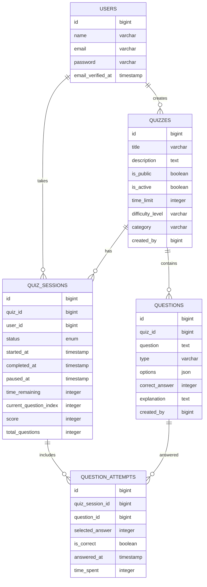

# Bài tập giữa kỳ: Xây dựng ứng dụng web theo nội dung đã đăng ký

**Họ và tên sinh viên:** [Tên sinh viên]

**Mã Sinh viên:** [Mã số sinh viên]

## Mô tả dự án
Ứng dụng Quiz Learning - Hệ thống tạo và làm bài trắc nghiệm trực tuyến được xây dựng bằng Laravel framework.

## Yêu cầu đã thực hiện

### 1. Sử dụng framework Laravel
- ✅ Sử dụng Laravel 11 với Livewire và Volt
- ✅ Cấu trúc MVC chuẩn Laravel
- ✅ Áp dụng các best practices của Laravel

### 2. Ít nhất 03 đối tượng chính
- ✅ **User**: Quản lý người dùng hệ thống
- ✅ **Quiz**: Quản lý bộ câu hỏi/bài thi
- ✅ **Question**: Quản lý câu hỏi và đáp án
- ✅ **QuizSession**: Quản lý phiên làm bài của người dùng
- ✅ **QuestionAttempt**: Quản lý các lần trả lời câu hỏi

### 3. Chức năng định danh và xác thực (User)
- ✅ Sử dụng Laravel Breeze cho authentication
- ✅ Đăng ký, đăng nhập, đăng xuất
- ✅ Quên mật khẩu và reset password
- ✅ Email verification
- ✅ Profile management

### 4. Xây dựng CRUD cho các đối tượng
- ✅ **Quiz CRUD**: Tạo, đọc, cập nhật, xóa quiz
- ✅ **Question CRUD**: Quản lý câu hỏi trong quiz
- ✅ **Quiz Session Management**: Theo dõi tiến trình làm bài
- ✅ **Question Attempt Tracking**: Lưu trữ các câu trả lời

### 5. Yêu cầu Security
- ✅ **CSRF Protection**: Sử dụng @csrf token trong tất cả forms
- ✅ **XSS Prevention**: Sử dụng {{ }} thay vì {!! !!} cho output
- ✅ **Data Validation**: Validation rules cho tất cả input
- ✅ **Authentication**: Middleware auth cho các route protected
- ✅ **Authorization**: Policy-based authorization cho quiz access
- ✅ **Session Security**: Secure session configuration
- ✅ **SQL Injection Prevention**: Sử dụng Eloquent ORM và prepared statements

### 6. Eloquent Migration trên Cloud Database
- ✅ Cấu hình database connection cho cloud (Aiven PostgreSQL)
- ✅ Migration files cho tất cả các bảng
- ✅ Relationships được định nghĩa trong Models
- ✅ Seeders cho dữ liệu mẫu

### 7. Documentation và Deployment
- ✅ README.md chi tiết với hướng dẫn setup
- ✅ Public link trên GitHub Codespaces
- ✅ Technical documentation cho Play Quiz feature

## Tính năng chính

### 🎯 Quản lý Quiz
- Tạo, chỉnh sửa, xóa quiz
- Quản lý độ khó, thời gian, và danh mục
- Thiết lập quyền public/private cho quiz

### ❓ Quản lý Câu hỏi
- Thêm câu hỏi trắc nghiệm với nhiều đáp án
- Giải thích đáp án đúng
- Sắp xếp thứ tự câu hỏi trong quiz

### 🎮 Làm Bài Trắc Nghiệm (Play Quiz)
- Giao diện làm bài thân thiện
- Đếm ngược thời gian
- Tạm dừng và tiếp tục làm bài
- Lưu tiến trình tự động
- Phân tích kết quả chi tiết

### 📊 Theo dõi Tiến độ
- Lịch sử các lần làm bài
- Phân tích điểm số và thời gian
- Thống kê hiệu suất

## Cấu trúc Database



## Technical Stack

- **Backend**: Laravel 11, PHP 8.2+
- **Frontend**: Livewire 3, Volt, TailwindCSS
- **Database**: PostgreSQL (Aiven Cloud)
- **Authentication**: Laravel Breeze
- **Deployment**: GitHub Codespaces

## Security Features Implemented

### 1. Input Validation
```php
// Example validation rules
'title' => 'required|string|max:255',
'description' => 'nullable|string|max:1000',
'time_limit' => 'required|integer|min:1|max:300',
```

### 2. Authorization Policies
```php
// Quiz access control
public function play(User $user, Quiz $quiz): bool
{
    return $quiz->is_active && 
           ($quiz->is_public || $quiz->created_by === $user->id);
}
```

### 3. CSRF Protection
```blade
<form wire:submit="createQuiz">
    @csrf
    <!-- Form fields -->
</form>
```

### 4. XSS Prevention
```blade
<!-- Safe output -->
<h1>{{ $quiz->title }}</h1>

<!-- Avoided dangerous output -->
<!-- {!! $userInput !!} -->
```

## Installation & Setup

1. **Clone repository**
```bash
git clone [repository-url]
cd next-quiz-learn
```

2. **Install dependencies**
```bash
composer install
npm install
```

3. **Environment setup**
```bash
cp .env.example .env
php artisan key:generate
```

4. **Database setup**
```bash
php artisan migrate
php artisan db:seed
```

5. **Start development server**
```bash
php artisan serve
npm run dev
```

## Live Demo

🔗 **Public URL**: [https://your-codespace-url.github.dev](https://your-codespace-url.github.dev)

## API Documentation

### Quiz Endpoints
- `GET /quizzes` - List all accessible quizzes
- `POST /quizzes` - Create new quiz
- `GET /quiz/{id}/play` - Start/resume quiz session
- `POST /quiz/{id}/submit` - Submit quiz answers

### Authentication
- `POST /login` - User login
- `POST /register` - User registration
- `POST /logout` - User logout

## Testing

```bash
# Run all tests
php artisan test

# Run specific test suite
php artisan test --testsuite=Feature
```

## Contributing

1. Fork the repository
2. Create feature branch (`git checkout -b feature/new-feature`)
3. Commit changes (`git commit -am 'Add new feature'`)
4. Push to branch (`git push origin feature/new-feature`)
5. Create Pull Request

## License

This project is licensed under the MIT License - see the [LICENSE](LICENSE) file for details.

---

**Ghi chú**: Đây là bài tập giữa kỳ cho môn học Web Development, thực hiện theo yêu cầu của giảng viên về việc xây dựng ứng dụng web sử dụng Laravel framework với đầy đủ các tính năng bảo mật và quản lý cơ sở dữ liệu trên cloud.
