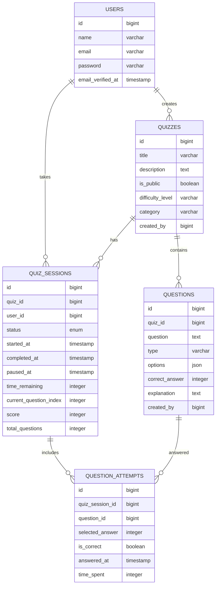

# Bài tập giữa kỳ: Quiz Web App

**Họ và tên sinh viên:** Trần Thành Long

**Mã Sinh viên:** 23010070

**Repository:** https://github.com/nielpattin/next-quiz-learn

## Mô tả dự án

Ứng dụng Quiz Learning - Hệ thống tạo và làm bài trắc nghiệm trực tuyến được xây dựng bằng Laravel framework.

## Yêu cầu đã thực hiện

### 1. Sử dụng framework Laravel

-   Sử dụng Laravel 11 với Livewire và Volt
-   Cấu trúc MVC chuẩn Laravel
-   Áp dụng các best practices của Laravel

### 2. Các đối tượng chính

-   **User**: Quản lý người dùng hệ thống
-   **Quiz**: Quản lý bộ câu hỏi/bài thi
-   **Question**: Quản lý câu hỏi và đáp án
-   **QuizSession**: Quản lý phiên làm bài của người dùng
-   **QuestionAttempt**: Quản lý các lần trả lời câu hỏi

### 3. Chức năng định danh và xác thực (User)

-   Sử dụng Laravel Breeze cho authentication
-   Đăng ký, đăng nhập, đăng xuất
-   Quên mật khẩu và reset password
-   Email verification
-   Profile management

### 4. Xây dựng CRUD cho các đối tượng

-   **Quiz CRUD**: Tạo, đọc, cập nhật, xóa quiz
-   **Question CRUD**: Quản lý câu hỏi trong quiz
-   **Quiz Session Management**: Theo dõi tiến trình làm bài
-   **Question Attempt Tracking**: Lưu trữ các câu trả lời

### 5. Yêu cầu Security

-   **CSRF Protection**: Sử dụng @csrf token trong tất cả forms
-   **XSS Prevention**: Sử dụng {{ }} thay vì {!! !!} cho output
-   **Data Validation**: Validation rules cho tất cả input
-   **Authentication**: Middleware auth cho các route protected
-   **Authorization**: Policy-based authorization cho quiz access
-   **Session Security**: Secure session configuration
-   **SQL Injection Prevention**: Sử dụng Eloquent ORM và prepared statements

### 6. Eloquent Migration trên Cloud Database

-   Cấu hình database connection cho cloud (Aiven PostgreSQL)
-   Migration files cho tất cả các bảng
-   Relationships được định nghĩa trong Models
-   Seeders cho dữ liệu mẫu

### 7. Documentation và Deployment

-   README.md chi tiết với hướng dẫn setup
-   Public link trên GitHub Codespaces
-   Technical documentation cho Play Quiz feature

## Tính năng chính

### 🎯 Quản lý Quiz

-   Tạo, chỉnh sửa, xóa quiz
-   Quản lý độ khó, thời gian, và danh mục
-   Thiết lập quyền public/private cho quiz

### ❓ Quản lý Câu hỏi

-   Thêm câu hỏi trắc nghiệm với nhiều đáp án
-   Giải thích đáp án đúng
-   Sắp xếp thứ tự câu hỏi trong quiz

### 🎮 Làm Bài Trắc Nghiệm (Play Quiz)

-   Giao diện làm bài thân thiện
-   Đếm ngược thời gian
-   Tạm dừng và tiếp tục làm bài
-   Lưu tiến trình tự động
-   Phân tích kết quả chi tiết

### 📊 Theo dõi Tiến độ

-   Lịch sử các lần làm bài
-   Phân tích điểm số và thời gian
-   Thống kê hiệu suất

## Cấu trúc Database



## Technical Stack

-   **Backend**: Laravel 12, PHP 8.2+
-   **Frontend**: Livewire 3, Volt, TailwindCSS
-   **Database**: PostgreSQL (Aiven Cloud)
-   **Authentication**: Laravel Breeze
-   **Deployment**: GitHub Codespaces

## Security Features Implemented

### 1. Input Validation

```php
// Example validation rules
'title' => 'required|string|max:255',
'description' => 'nullable|string|max:1000',
```

### 2. Authorization Policies

```php
// Quiz access control
public function play(User $user, Quiz $quiz): bool
{
    return $quiz->is_public || $quiz->created_by === $user->id;
}
```

### 3. CSRF Protection

```blade
<form wire:submit="createQuiz">
    @csrf
    <!-- Form fields -->
</form>
```

### 4. XSS Prevention

```blade
<!-- Safe output -->
<h1>{{ $quiz->title }}</h1>

<!-- Avoided dangerous output -->
<!-- {!! $userInput !!} -->
```

## Installation & Setup

1. **Clone repository**

```bash
git clone [repository-url]
cd next-quiz-learn
```

2. **Install dependencies**

```bash
composer install
npm install
```

3. **Environment setup**

```bash
cp .env.example .env
php artisan key:generate
```

4. **Database setup**

```bash
php artisan migrate
php artisan db:seed
```

5. **Start development server**

```bash
php artisan serve
npm run dev
```

## API Documentation

### Quiz Endpoints

-   `GET /quizzes` - List all accessible quizzes
-   `POST /quizzes` - Create new quiz
-   `GET /quiz/{id}/play` - Start/resume quiz session
-   `POST /quiz/{id}/submit` - Submit quiz answers

### Authentication

-   `POST /login` - User login
-   `POST /register` - User registration
-   `POST /logout` - User logout


## Contributing

1. Fork the repository
2. Create feature branch (`git checkout -b feature/new-feature`)
3. Commit changes (`git commit -am 'Add new feature'`)
4. Push to branch (`git push origin feature/new-feature`)
5. Create Pull Request

## License

This project is licensed under the MIT License - see the [LICENSE](LICENSE) file for details.


composer update
php artisan view:clear
php artisan cache:clear
php artisan config:clear
php artisan route:clear
composer dump-autoload