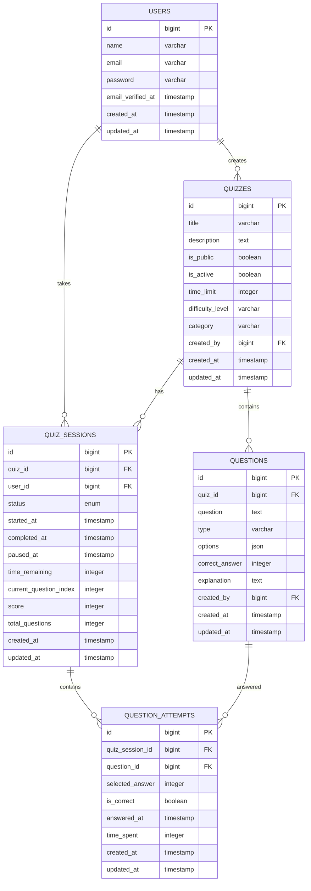
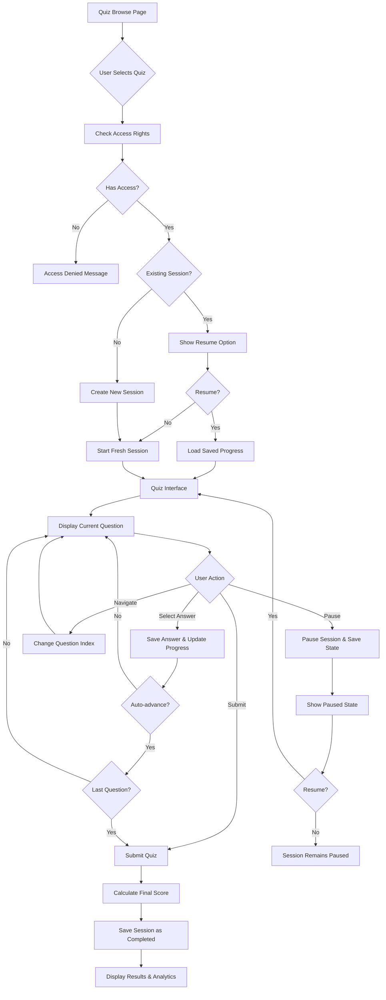

# Technical Design: "Làm Bài Trắc Nghiệm" (Play Quiz) Feature

## Overview

This document outlines the technical design and implementation plan for the Play Quiz feature - a comprehensive quiz-taking experience with timer functionality, progress tracking, pause/resume capabilities, and detailed analytics.

## System Requirements

### Functional Requirements
- **Full-featured quiz interface** with timer, progress tracking, and pause/resume capability
- **Mixed access control**: Users can play their own quizzes plus public quizzes from other creators
- **Auto-save progress**: Users can resume exactly where they left off with remaining time intact
- **Comprehensive analytics** after quiz completion

### Non-Functional Requirements
- Responsive design for mobile and desktop
- Real-time timer updates
- Secure session management
- Database optimization for concurrent users

## Database Schema Design

### Required Schema Changes

#### 1. Add Public/Private Support to Quizzes
```sql
ALTER TABLE quizzes ADD COLUMN is_public BOOLEAN DEFAULT FALSE;
```

#### 2. Quiz Sessions Table
```sql
CREATE TABLE quiz_sessions (
    id BIGINT PRIMARY KEY AUTO_INCREMENT,
    quiz_id BIGINT NOT NULL,
    user_id BIGINT NOT NULL,
    status ENUM('in_progress', 'paused', 'completed', 'expired') DEFAULT 'in_progress',
    started_at TIMESTAMP NULL,
    completed_at TIMESTAMP NULL,
    paused_at TIMESTAMP NULL,
    time_remaining INTEGER NOT NULL,
    current_question_index INTEGER DEFAULT 0,
    score INTEGER DEFAULT 0,
    total_questions INTEGER NOT NULL,
    created_at TIMESTAMP DEFAULT CURRENT_TIMESTAMP,
    updated_at TIMESTAMP DEFAULT CURRENT_TIMESTAMP ON UPDATE CURRENT_TIMESTAMP,
    
    FOREIGN KEY (quiz_id) REFERENCES quizzes(id) ON DELETE CASCADE,
    FOREIGN KEY (user_id) REFERENCES users(id) ON DELETE CASCADE,
    INDEX idx_quiz_user (quiz_id, user_id),
    INDEX idx_user_status (user_id, status)
);
```

#### 3. Question Attempts Table
```sql
CREATE TABLE question_attempts (
    id BIGINT PRIMARY KEY AUTO_INCREMENT,
    quiz_session_id BIGINT NOT NULL,
    question_id BIGINT NOT NULL,
    selected_answer INTEGER NULL,
    is_correct BOOLEAN DEFAULT FALSE,
    answered_at TIMESTAMP NULL,
    time_spent INTEGER DEFAULT 0,
    created_at TIMESTAMP DEFAULT CURRENT_TIMESTAMP,
    updated_at TIMESTAMP DEFAULT CURRENT_TIMESTAMP ON UPDATE CURRENT_TIMESTAMP,
    
    FOREIGN KEY (quiz_session_id) REFERENCES quiz_sessions(id) ON DELETE CASCADE,
    FOREIGN KEY (question_id) REFERENCES questions(id) ON DELETE CASCADE,
    UNIQUE KEY unique_session_question (quiz_session_id, question_id),
    INDEX idx_session_id (quiz_session_id)
);
```

### Entity Relationship Diagram



## Component Architecture

### Primary Livewire Component: PlayQuiz

**File Location**: `app/Livewire/PlayQuiz.php`

#### Public Properties
```php
<?php

namespace App\Livewire;

use App\Models\Quiz;
use App\Models\QuizSession;
use App\Models\Question;
use App\Models\QuestionAttempt;
use Illuminate\Support\Collection;
use Livewire\Component;

class PlayQuiz extends Component
{
    // Core quiz data
    public Quiz $quiz;
    public Collection $questions;
    public QuizSession $session;

    // Current state
    public int $currentQuestionIndex = 0;
    public ?int $selectedAnswer = null;
    public array $userAnswers = [];

    // Timer and progress
    public int $timeRemaining;
    public bool $isPaused = false;
    public bool $isCompleted = false;

    // UI state
    public bool $showResults = false;
    public bool $canResume = false;
    public bool $showConfirmSubmit = false;
}
```

#### Key Methods
```php
// Lifecycle methods
public function mount(Quiz $quiz): void
public function hydrate(): void

// Quiz flow control
public function startQuiz(): void
public function resumeQuiz(): void
public function pauseQuiz(): void
public function submitQuiz(): void
public function restartQuiz(): void

// Question navigation
public function selectAnswer(int $answer): void
public function nextQuestion(): void
public function previousQuestion(): void
public function goToQuestion(int $index): void

// Timer management
public function updateTimer(): void
public function handleTimerExpired(): void

// Progress management
private function saveProgress(): void
private function loadExistingSession(): ?QuizSession
private function calculateScore(): int
private function canAccessQuiz(Quiz $quiz): bool
```

### Child Components

#### 1. QuizTimer Component
**File**: `resources/views/components/quiz-timer.blade.php`

```php
@props(['timeRemaining', 'isPaused'])

<div class="flex items-center space-x-2 text-lg font-mono">
    @if($isPaused)
        <svg class="w-5 h-5 text-yellow-500" fill="currentColor" viewBox="0 0 20 20">
            <path fill-rule="evenodd" d="M18 10a8 8 0 11-16 0 8 8 0 0116 0zM7 8a1 1 0 012 0v4a1 1 0 11-2 0V8zm5-1a1 1 0 00-1 1v4a1 1 0 102 0V8a1 1 0 00-1-1z"/>
        </svg>
        <span class="text-yellow-600">PAUSED</span>
    @else
        <svg class="w-5 h-5 text-red-500" fill="currentColor" viewBox="0 0 20 20">
            <path fill-rule="evenodd" d="M10 18a8 8 0 100-16 8 8 0 000 16zM8.707 7.293a1 1 0 00-1.414 1.414L8.586 10l-1.293 1.293a1 1 0 101.414 1.414L10 11.414l1.293 1.293a1 1 0 001.414-1.414L11.414 10l1.293-1.293a1 1 0 00-1.414-1.414L10 8.586 8.707 7.293z"/>
        </svg>
    @endif
    
    <span class="@if($timeRemaining < 300) text-red-600 @else text-gray-700 @endif">
        {{ sprintf('%02d:%02d', floor($timeRemaining / 60), $timeRemaining % 60) }}
    </span>
</div>
```

#### 2. ProgressBar Component
**File**: `resources/views/components/progress-bar.blade.php`

```php
@props(['current', 'total', 'answeredQuestions'])

<div class="w-full">
    <div class="flex justify-between text-sm text-gray-600 mb-2">
        <span>Question {{ $current + 1 }} of {{ $total }}</span>
        <span>{{ count($answeredQuestions) }}/{{ $total }} answered</span>
    </div>
    
    <div class="w-full bg-gray-200 rounded-full h-2">
        <div class="bg-blue-600 h-2 rounded-full transition-all duration-300" 
             style="width: {{ ($current / max($total - 1, 1)) * 100 }}%"></div>
    </div>
    
    <div class="flex justify-between mt-2">
        @for($i = 0; $i < $total; $i++)
            <div class="w-3 h-3 rounded-full 
                @if($i < $current) bg-blue-600
                @elseif($i == $current) bg-blue-400
                @elseif(in_array($i, $answeredQuestions)) bg-green-400
                @else bg-gray-300
                @endif">
            </div>
        @endfor
    </div>
</div>
```

#### 3. QuestionCard Component
**File**: `resources/views/components/question-card.blade.php`

```php
@props(['question', 'selectedAnswer', 'questionNumber', 'totalQuestions'])

<div class="bg-white rounded-lg shadow-md p-6">
    <div class="mb-4">
        <h2 class="text-lg font-semibold text-gray-800 mb-2">
            Question {{ $questionNumber }} of {{ $totalQuestions }}
        </h2>
        <p class="text-gray-700 text-base leading-relaxed">
            {{ $question->question }}
        </p>
    </div>
    
    <div class="space-y-3">
        @foreach($question->options as $index => $option)
            <label class="flex items-center p-3 border rounded-lg cursor-pointer hover:bg-gray-50 
                @if($selectedAnswer === $index) border-blue-500 bg-blue-50 @else border-gray-300 @endif">
                <input type="radio" 
                       name="answer" 
                       value="{{ $index }}"
                       wire:model.live="selectedAnswer"
                       class="mr-3 text-blue-600">
                <span class="text-gray-700">
                    <strong>{{ chr(65 + $index) }})</strong> {{ $option }}
                </span>
            </label>
        @endforeach
    </div>
</div>
```

#### 4. QuizResults Component
**File**: `resources/views/components/quiz-results.blade.php`

```php
@props(['session', 'questions', 'attempts'])

<div class="max-w-4xl mx-auto">
    <!-- Summary Card -->
    <div class="bg-white rounded-lg shadow-md p-6 mb-6">
        <h2 class="text-2xl font-bold text-gray-800 mb-4">Quiz Results</h2>
        
        <div class="grid grid-cols-1 md:grid-cols-4 gap-4">
            <div class="text-center p-4 bg-blue-50 rounded-lg">
                <div class="text-3xl font-bold text-blue-600">{{ $session->score }}</div>
                <div class="text-sm text-gray-600">Score</div>
            </div>
            <div class="text-center p-4 bg-green-50 rounded-lg">
                <div class="text-3xl font-bold text-green-600">
                    {{ round(($session->score / $session->total_questions) * 100) }}%
                </div>
                <div class="text-sm text-gray-600">Accuracy</div>
            </div>
            <div class="text-center p-4 bg-yellow-50 rounded-lg">
                <div class="text-3xl font-bold text-yellow-600">
                    {{ $session->total_questions - $session->score }}
                </div>
                <div class="text-sm text-gray-600">Incorrect</div>
            </div>
            <div class="text-center p-4 bg-purple-50 rounded-lg">
                <div class="text-3xl font-bold text-purple-600">
                    {{ gmdate('i:s', $attempts->sum('time_spent')) }}
                </div>
                <div class="text-sm text-gray-600">Time Spent</div>
            </div>
        </div>
    </div>

    <!-- Question-by-Question Analysis -->
    <div class="space-y-4">
        @foreach($questions as $index => $question)
            @php
                $attempt = $attempts->where('question_id', $question->id)->first();
                $isCorrect = $attempt && $attempt->is_correct;
            @endphp
            
            <div class="bg-white rounded-lg shadow-md p-6">
                <div class="flex items-start justify-between mb-3">
                    <h3 class="font-semibold text-gray-800">
                        Question {{ $index + 1 }}
                    </h3>
                    <span class="inline-flex items-center px-2.5 py-0.5 rounded-full text-xs font-medium
                        @if($isCorrect) bg-green-100 text-green-800 @else bg-red-100 text-red-800 @endif">
                        @if($isCorrect) Correct @else Incorrect @endif
                    </span>
                </div>
                
                <p class="text-gray-700 mb-4">{{ $question->question }}</p>
                
                <div class="space-y-2 mb-4">
                    @foreach($question->options as $optionIndex => $option)
                        <div class="flex items-center p-2 rounded
                            @if($optionIndex === $question->correct_answer) bg-green-50 border border-green-200
                            @elseif($attempt && $attempt->selected_answer === $optionIndex && $optionIndex !== $question->correct_answer) bg-red-50 border border-red-200
                            @else bg-gray-50 @endif">
                            
                            @if($optionIndex === $question->correct_answer)
                                <svg class="w-5 h-5 text-green-600 mr-2" fill="currentColor" viewBox="0 0 20 20">
                                    <path fill-rule="evenodd" d="M16.707 5.293a1 1 0 010 1.414l-8 8a1 1 0 01-1.414 0l-4-4a1 1 0 011.414-1.414L8 12.586l7.293-7.293a1 1 0 011.414 0z"/>
                                </svg>
                            @elseif($attempt && $attempt->selected_answer === $optionIndex && $optionIndex !== $question->correct_answer)
                                <svg class="w-5 h-5 text-red-600 mr-2" fill="currentColor" viewBox="0 0 20 20">
                                    <path fill-rule="evenodd" d="M4.293 4.293a1 1 0 011.414 0L10 8.586l4.293-4.293a1 1 0 111.414 1.414L11.414 10l4.293 4.293a1 1 0 01-1.414 1.414L10 11.414l-4.293 4.293a1 1 0 01-1.414-1.414L8.586 10 4.293 5.707a1 1 0 010-1.414z"/>
                                </svg>
                            @else
                                <div class="w-5 h-5 mr-2"></div>
                            @endif
                            
                            <span class="text-gray-700">
                                <strong>{{ chr(65 + $optionIndex) }})</strong> {{ $option }}
                            </span>
                        </div>
                    @endforeach
                </div>
                
                @if($question->explanation)
                    <div class="bg-blue-50 border border-blue-200 rounded p-3">
                        <h4 class="font-medium text-blue-800 mb-1">Explanation:</h4>
                        <p class="text-blue-700 text-sm">{{ $question->explanation }}</p>
                    </div>
                @endif
            </div>
        @endforeach
    </div>
</div>
```

## File Structure

```
app/
├── Livewire/
│   ├── PlayQuiz.php                 # Main quiz component
│   └── QuizBrowse.php               # Quiz selection component
├── Models/
│   ├── QuizSession.php              # Quiz session model
│   └── QuestionAttempt.php          # Question attempt model
└── Policies/
    └── QuizPolicy.php               # Quiz access authorization

resources/views/
├── livewire/
│   ├── play-quiz.blade.php          # Main quiz interface
│   └── quiz-browse.blade.php        # Quiz selection page
├── components/
│   ├── quiz-timer.blade.php         # Timer component
│   ├── question-card.blade.php      # Question display
│   ├── progress-bar.blade.php       # Progress indicator
│   └── quiz-results.blade.php       # Results display

database/migrations/
├── add_is_public_to_quizzes_table.php
├── create_quiz_sessions_table.php
└── create_question_attempts_table.php

routes/
└── web.php                          # Updated with new routes
```

## Component Flow Architecture



## Model Definitions

### QuizSession Model
**File**: `app/Models/QuizSession.php`

```php
<?php

namespace App\Models;

use Illuminate\Database\Eloquent\Model;
use Illuminate\Database\Eloquent\Relations\BelongsTo;
use Illuminate\Database\Eloquent\Relations\HasMany;

class QuizSession extends Model
{
    protected $fillable = [
        'quiz_id',
        'user_id',
        'status',
        'started_at',
        'completed_at',
        'paused_at',
        'time_remaining',
        'current_question_index',
        'score',
        'total_questions',
    ];

    protected $casts = [
        'started_at' => 'datetime',
        'completed_at' => 'datetime',
        'paused_at' => 'datetime',
        'time_remaining' => 'integer',
        'current_question_index' => 'integer',
        'score' => 'integer',
        'total_questions' => 'integer',
    ];

    public function quiz(): BelongsTo
    {
        return $this->belongsTo(Quiz::class);
    }

    public function user(): BelongsTo
    {
        return $this->belongsTo(User::class);
    }

    public function questionAttempts(): HasMany
    {
        return $this->hasMany(QuestionAttempt::class);
    }

    public function isInProgress(): bool
    {
        return $this->status === 'in_progress';
    }

    public function isPaused(): bool
    {
        return $this->status === 'paused';
    }

    public function isCompleted(): bool
    {
        return $this->status === 'completed';
    }

    public function getFormattedTimeRemainingAttribute(): string
    {
        $minutes = floor($this->time_remaining / 60);
        $seconds = $this->time_remaining % 60;
        return sprintf('%02d:%02d', $minutes, $seconds);
    }

    public function getAccuracyPercentageAttribute(): float
    {
        if ($this->total_questions === 0) {
            return 0;
        }
        return round(($this->score / $this->total_questions) * 100, 2);
    }
}
```

### QuestionAttempt Model
**File**: `app/Models/QuestionAttempt.php`

```php
<?php

namespace App\Models;

use Illuminate\Database\Eloquent\Model;
use Illuminate\Database\Eloquent\Relations\BelongsTo;

class QuestionAttempt extends Model
{
    protected $fillable = [
        'quiz_session_id',
        'question_id',
        'selected_answer',
        'is_correct',
        'answered_at',
        'time_spent',
    ];

    protected $casts = [
        'selected_answer' => 'integer',
        'is_correct' => 'boolean',
        'answered_at' => 'datetime',
        'time_spent' => 'integer',
    ];

    public function quizSession(): BelongsTo
    {
        return $this->belongsTo(QuizSession::class);
    }

    public function question(): BelongsTo
    {
        return $this->belongsTo(Question::class);
    }

    public function getFormattedTimeSpentAttribute(): string
    {
        if ($this->time_spent < 60) {
            return $this->time_spent . 's';
        }
        
        $minutes = floor($this->time_spent / 60);
        $seconds = $this->time_spent % 60;
        return sprintf('%dm %ds', $minutes, $seconds);
    }
}
```

## Security Considerations

### Authorization Policy
**File**: `app/Policies/QuizPolicy.php`

```php
<?php

namespace App\Policies;

use App\Models\Quiz;
use App\Models\User;

class QuizPolicy
{
    public function play(User $user, Quiz $quiz): bool
    {
        // Quiz must be active
        if (!$quiz->is_active) {
            return false;
        }

        // User can play their own quizzes
        if ($quiz->created_by === $user->id) {
            return true;
        }

        // User can play public quizzes from others
        return $quiz->is_public;
    }

    public function resume(User $user, Quiz $quiz): bool
    {
        return $this->play($user, $quiz);
    }
}
```

### Input Validation
```php
// In PlayQuiz component
protected $rules = [
    'selectedAnswer' => 'required|integer|min:0|max:3',
    'currentQuestionIndex' => 'required|integer|min:0',
];

public function selectAnswer(int $answer): void
{
    $this->validate([
        'selectedAnswer' => 'required|integer|min:0|max:3',
    ]);
    
    // Additional business logic validation
    if ($this->session->isCompleted()) {
        throw new \Exception('Cannot modify completed quiz session');
    }
    
    // Continue with answer processing...
}
```

## Routes Configuration

**File**: `routes/web.php` (additions)

```php
Route::middleware(['auth'])->group(function () {
    // Existing routes...
    
    // Quiz browsing and playing
    Volt::route('quizzes/browse', 'quiz-browse')->name('quizzes.browse');
    Volt::route('quiz/{quiz}/play', 'play-quiz')->name('quiz.play');
    Volt::route('quiz/{session}/results', 'quiz.results')->name('quiz.results');
});
```

## Performance Optimizations

### Database Indexing
```sql
-- Optimize quiz session queries
CREATE INDEX idx_quiz_sessions_user_status ON quiz_sessions(user_id, status);
CREATE INDEX idx_quiz_sessions_quiz_active ON quiz_sessions(quiz_id, status);

-- Optimize question attempts queries
CREATE INDEX idx_question_attempts_session ON question_attempts(quiz_session_id);
CREATE INDEX idx_question_attempts_timing ON question_attempts(quiz_session_id, answered_at);
```

### Livewire Optimizations
```php
// Use lazy loading for heavy queries
#[Lazy]
public function getDetailedAnalytics()
{
    return $this->questionAttempts()
        ->with(['question'])
        ->orderBy('answered_at')
        ->get();
}

// Optimize real-time updates
protected $queryString = [
    'currentQuestionIndex' => ['except' => 0],
    'selectedAnswer' => ['except' => null],
];
```

## Testing Strategy

### Feature Tests
```php
// Example test structure
class PlayQuizTest extends TestCase
{
    public function test_user_can_start_quiz(): void
    public function test_user_can_pause_and_resume_quiz(): void
    public function test_timer_expires_automatically_submits(): void
    public function test_user_cannot_access_private_quiz(): void
    public function test_quiz_session_persists_on_page_reload(): void
    public function test_final_score_calculation_is_accurate(): void
}
```

## Implementation Priority

### Phase 1: Core Infrastructure
1. Database migrations
2. Model definitions
3. Basic Livewire component structure

### Phase 2: Quiz Flow
1. Quiz browsing page
2. Quiz start/resume logic
3. Question navigation
4. Answer selection and saving

### Phase 3: Advanced Features
1. Timer implementation
2. Pause/resume functionality
3. Auto-save progress
4. Results and analytics

### Phase 4: Polish & Optimization
1. UI/UX improvements
2. Performance optimization
3. Comprehensive testing
4. Security hardening

This technical design provides a comprehensive blueprint for implementing the Play Quiz feature with all requested functionality while maintaining security, performance, and scalability considerations.